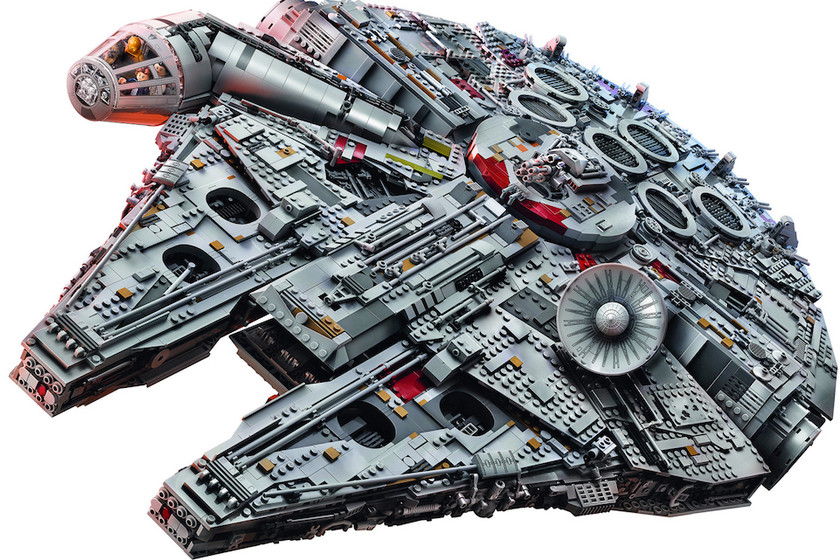

# Bienvenido a *Star Wars Docs* ✨

!!! info "Guía Completa del Universo Star Wars"
    Esta documentación recopila información esencial del universo **Star Wars** para aficionados, desarrolladores de lore y exploradores galácticos. Desde personajes icónicos hasta tecnología avanzada.



---

## 🌌 Explora la Galaxia Muy, Muy Lejana

!!! tip "Navegación Rápida"
    Usa la navegación lateral para saltar rápidamente entre secciones, o explora nuestras guías principales:
    
    - 👥 [Personajes](characters.md) - Héroes, villanos y droides
    - 🌍 [Planetas](planets.md) - Mundos icónicos de la galaxia
    - 🚀 [Tecnología](technology.md) - Naves, armas y superarmas

---

## 📊 Resumen de la Saga

| Trilogía | Episodios | Años de Estreno | Director Principal | Tema Central |
|----------|-----------|-----------------|-------------------|--------------|
| **Original** | IV, V, VI | 1977-1983 | George Lucas | La Rebelión vs Imperio |
| **Precuela** | I, II, III | 1999-2005 | George Lucas | La caída de Anakin |
| **Secuela** | VII, VIII, IX | 2015-2019 | J.J. Abrams, Rian Johnson | Nueva generación de héroes |

### Cronología Galáctica
!!! note "Línea de Tiempo BBY/ABY"
    - **BBY**: Before the Battle of Yavin (Antes de la Batalla de Yavin)
    - **ABY**: After the Battle of Yavin (Después de la Batalla de Yavin)

---

## 💻 Recursos para Desarrolladores

=== "API de Personajes"
    ```python
    # Ejemplo de estructura de datos para personajes
    class StarWarsCharacter:
        def __init__(self, name, species, homeworld, affiliation):
            self.name = name
            self.species = species
            self.homeworld = homeworld
            self.affiliation = affiliation
            self.force_sensitive = False
        
        def set_force_powers(self, is_sensitive, alignment="neutral"):
            self.force_sensitive = is_sensitive
            self.force_alignment = alignment
        
        def get_character_info(self):
            return {
                "name": self.name,
                "species": self.species,
                "homeworld": self.homeworld,
                "affiliation": self.affiliation,
                "force_user": self.force_sensitive
            }

    # Ejemplo de uso
    luke = StarWarsCharacter("Luke Skywalker", "Human", "Tatooine", "Rebel Alliance")
    luke.set_force_powers(True, "light")
    print(luke.get_character_info())
    ```

=== "Estructura JSON"
    ```json
    {
      "character": {
        "id": "luke_skywalker",
        "name": "Luke Skywalker",
        "species": "Human",
        "gender": "Male",
        "homeworld": "Tatooine",
        "affiliation": ["Rebel Alliance", "New Republic", "Jedi Order"],
        "force_sensitive": true,
        "force_alignment": "Light Side",
        "weapons": ["Lightsaber", "Blaster"],
        "vehicles": ["X-Wing T-65", "Landspeeder"],
        "appearances": ["Episode IV", "Episode V", "Episode VI"]
      }
    }
    ```

=== "YAML Config"
    ```yaml
    # Configuración para base de datos Star Wars
    galaxy:
      regions:
        - core_worlds
        - inner_rim
        - mid_rim
        - outer_rim
        - unknown_regions
      
      major_factions:
        light_side:
          - jedi_order
          - rebel_alliance
          - new_republic
          - resistance
        
        dark_side:
          - sith_empire
          - galactic_empire
          - first_order
          - final_order
        
        neutral:
          - smugglers
          - bounty_hunters
          - mandalorians
          - corporations
    
    data_sources:
      canonical: true
      legends: false
      current_era: "sequel_trilogy"
    ```

---

## 🎬 Eras Cinematográficas

### Trilogía Original (1977-1983)
!!! success "La Saga que Comenzó Todo"
    La historia de Luke Skywalker y la lucha entre el Imperio Galáctico y la Alianza Rebelde.

**Películas principales:**
- **Episodio IV**: Una Nueva Esperanza (1977)
- **Episodio V**: El Imperio Contraataca (1980) 
- **Episodio VI**: El Retorno del Jedi (1983)

### Trilogía de Precuelas (1999-2005)
!!! warning "El Ascenso del Imperio"
    La historia de Anakin Skywalker y su transformación en Darth Vader.

**Películas principales:**
- **Episodio I**: La Amenaza Fantasma (1999)
- **Episodio II**: El Ataque de los Clones (2002)
- **Episodio III**: La Venganza de los Sith (2005)

### Trilogía de Secuelas (2015-2019)
!!! info "Una Nueva Generación"
    La historia de Rey y la lucha contra la Primera Orden y el Emperador resucitado.

**Películas principales:**
- **Episodio VII**: El Despertar de la Fuerza (2015)
- **Episodio VIII**: Los Últimos Jedi (2017)
- **Episodio IX**: El Ascenso de Skywalker (2019)

---

## 🌟 Contenido Destacado

### Series y Spin-offs
!!! tip "Contenido Expandido"
    El universo de Star Wars se ha expandido enormemente con series de TV, libros y videojuegos.

| Tipo | Título | Año | Plataforma |
|------|--------|-----|------------|
| **Serie** | The Mandalorian | 2019-presente | Disney+ |
| **Serie** | The Clone Wars | 2008-2020 | Disney+/Cartoon Network |
| **Serie** | Rebels | 2014-2018 | Disney XD |
| **Serie** | The Book of Boba Fett | 2021-2022 | Disney+ |
| **Serie** | Obi-Wan Kenobi | 2022 | Disney+ |
| **Serie** | Andor | 2022-presente | Disney+ |

### Videojuegos Icónicos
??? success "Juegos Legendarios"
    - **Knights of the Old Republic** (2003) - RPG clásico
    - **Battlefront** series (2004-presente) - Combate masivo
    - **Jedi: Fallen Order** (2019) - Aventura de un Jedi
    - **The Old Republic** (2011-presente) - MMORPG

---

## 🔍 Datos Curiosos

!!! note "¿Sabías que...?"
    - Star Wars fue inicialmente rechazada por varios estudios
    - El famoso "Wilhelm Scream" aparece en todas las películas originales
    - Yoda no tenía nombre hasta "El Imperio Contraataca"
    - El sable de luz de Luke en "El Retorno del Jedi" iba a ser azul originalmente

!!! warning "Universo Expandido"
    En 2014, Disney declaró que el Universo Expandido (ahora llamado "Legends") ya no era canon oficial, pero sigue siendo amado por los fans.

---

## 🚀 Comienza tu Aventura

### Para Nuevos Fans
1. **Empieza con**: Episodio IV - Una Nueva Esperanza
2. **Continúa con**: La trilogía original (IV, V, VI)
3. **Explora**: [Personajes principales](characters.md)
4. **Descubre**: [Mundos icónicos](planets.md)

### Para Fans Veteranos
1. **Profundiza en**: [Tecnología avanzada](technology.md)
2. **Explora**: Cronología completa de eventos
3. **Compara**: Diferencias entre Canon y Legends
4. **Analiza**: Evolución de la saga a través de las décadas

---

!!! quote "Cita Icónica"
    *"Que la Fuerza te acompañe"* - Frase icónica del universo Star Wars

---

## 📚 Navegación Rápida

<div style="display: grid; grid-template-columns: repeat(auto-fit, minmax(250px, 1fr)); gap: 20px; margin: 20px 0;">
    <div style="border: 2px solid #4CAF50; padding: 15px; border-radius: 8px; text-align: center;">
        <h3>👥 Personajes</h3>
        <p>Héroes, villanos y droides icónicos</p>
        <a href="characters.md" style="color: #4CAF50; font-weight: bold;">Explorar →</a>
    </div>
    <div style="border: 2px solid #2196F3; padding: 15px; border-radius: 8px; text-align: center;">
        <h3>🌍 Planetas</h3>
        <p>Mundos fascinantes de la galaxia</p>
        <a href="planets.md" style="color: #2196F3; font-weight: bold;">Explorar →</a>
    </div>
    <div style="border: 2px solid #FF9800; padding: 15px; border-radius: 8px; text-align: center;">
        <h3>🚀 Tecnología</h3>
        <p>Naves, armas y superarmas</p>
        <a href="technology.md" style="color: #FF9800; font-weight: bold;">Explorar →</a>
    </div>
</div>

---

*Que la documentación esté contigo, siempre.*
